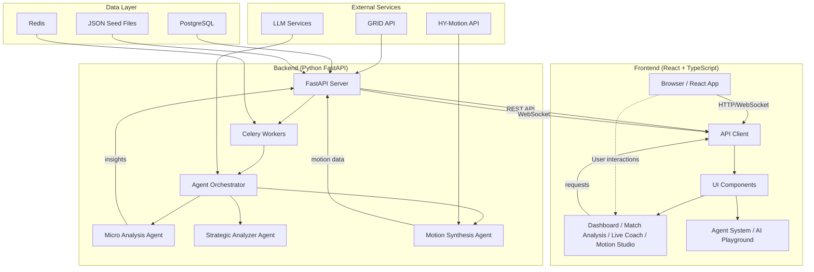

# Technical Implementation

This document explains the architecture, key components, and engineering choices for the project. Use this as the single-source technical summary for judges and engineers.

---

## Overview

**Project:** AI-Powered Esports Analytics & Coaching Platform  
**Purpose:** Real-time match analysis, player development insights, AI coaching assistance, and tactical motion synthesis for competitive gaming.  
**Main languages / tools:** TypeScript, React, Vite, Python (FastAPI), PostgreSQL, Redis, Celery, Vitest, ESLint, Prettier, Husky + lint-staged, GitHub Actions.

---

## Quick Start (Dev)

```bash
# Install dependencies
npm ci

# Run dev frontend
npm run dev

# Run backend (see backend/README.md)
cd backend
docker-compose up

# Run tests
npm run test

# Lint & format
npm run lint
npm run format
```

---

## Architecture (High-Level)

### Mermaid Diagram



### ASCII Diagram

```
[Browser UI] <--HTTP/WebSocket--> [FastAPI Server]
     |                                    |
[React Components]                    [Celery Workers]
[Agent Context]                      [Agent Orchestrator]
[State Management]                   [Micro Analysis]
                                     [Strategic Analysis]
                                     [Motion Synthesis]
                                     |
                              [PostgreSQL / Redis]
```

---

## Components & Responsibilities

### Frontend (`src/`)

- **`lib/apiClient.ts`** — Unified API client with error handling, interceptors, and retry logic
- **`lib/config.ts`** — Environment configuration management
- **`lib/utils.ts`** — Utility functions (class name merging, etc.)
- **`context/AgentContext.tsx`** — Central state for agent interactions
- **`components/`** — Reusable UI components (shadcn/ui based)
  - `dashboard/` — Analytics dashboards
  - `agent/` — Agent system components
  - `motion/` — Motion visualization
  - `predictions/` — Prediction markets UI
- **`pages/`** — Route-level page components
- **`services/`** — Business logic services
- **`hooks/`** — Custom React hooks
- **`store/`** — Zustand state management

### Backend (`backend/`)

- **`app/main.py`** — FastAPI application entry point
- **`app/api.py`** — REST API endpoints
- **`app/agents/`** — Agent implementations
  - `micro_analysis.py` — Micro-pattern detection
  - `strategic_analyzer.py` — Strategic analysis
  - `orchestrator.py` — Agent orchestration
- **`app/celery_app.py`** — Celery task queue setup
- **`app/db.py`** — Database connection and models
- **`app/features.py`** — Feature extraction for ML
- **`app/ml/`** — Machine learning models
- **`app/ws_*.py`** — WebSocket endpoints for real-time updates

---

## Quality & CI

We demonstrate software quality via:

- **Type Safety:** TypeScript with `strict: true` in `tsconfig.json`
- **Linting & Formatting:** ESLint + Prettier; pre-commit hooks via Husky + lint-staged
- **Automated Tests:** Vitest for unit tests (critical paths: API client, utilities, config)
- **CI:** GitHub Actions runs lint, typecheck, tests, and build on PRs
- **Code Coverage:** Aim for ≥70% coverage on core logic

See `.github/workflows/ci.yml` for the CI pipeline.

### Test Coverage

- **Unit Tests:** `src/lib/__tests__/` — Core utilities and API client
- **Integration Tests:** Backend Python tests via pytest
- **Critical Paths:** SSE parsing, event handling, agent communication

---

## Developer Ergonomics & IDE

### Recommended Workflow

- **JetBrains WebStorm / IntelliJ IDEA** for instant type-aware navigation
- **Pre-commit hooks** run ESLint & Prettier to keep code consistent
- **Hot-reload** via Vite for instant feedback during development

### Using JetBrains Junie (AI Coding Agent)

If using JetBrains Junie for code generation:

- Document AI-assisted changes in commit messages: `chore: add SSE parser (generated with Junie; reviewed)`
- All AI-generated code is reviewed and unit tested
- See `docs/ai-assist.md` (if created) for examples

---

## Observability & Debugging

- **Structured logging** on backend (server-side) for replayability
- **Health endpoints:** `/health` for service status
- **WebSocket logging** for real-time event debugging
- **Sample data** for deterministic demos (`sample-data/`)

---

## Security & Privacy

- **Environment variables:** `.env` files (never committed; `.env.example` provided)
- **No hardcoded secrets:** All API keys via environment
- **Input validation:** Zod schemas for type-safe validation
- **CORS:** Configured for development and production origins
- **Dependency scanning:** `npm audit` runs in CI

---

## Known Limitations & TODOs

- **Security:** Sample server for dev only; production requires proper auth & rate limiting
- **Persistence:** Currently uses JSON seed files for demo; PostgreSQL for production
- **Scaling:** WebSocket connections need robust connection management for production
- **Type Safety:** Some legacy code may need gradual migration to strict TypeScript
- **Test Coverage:** Expanding test coverage for agent system and WebSocket handlers

---

## Build & Deployment

### Local Development

```bash
npm run dev          # Start Vite dev server (port 8080)
npm run build        # Production build
npm run preview      # Preview production build
```

### Backend Services

```bash
cd backend
docker-compose up    # Start all services (API, Redis, PostgreSQL, Celery)
```

### CI/CD

- **GitHub Actions** automatically runs on push/PR:
  - Lint check
  - Type checking
  - Unit tests with coverage
  - Build verification
  - Security audit

---

## Contact & Provenance

**Author / Maintainer:** [Your Name or handle]  
**Demo:** See README.md for demo instructions  
**Notes:** Code generated with AI assistance (e.g., Junie) is explicitly reviewed and unit-tested.

---

## File Structure

```
.
├── src/                    # Frontend React app
│   ├── components/         # UI components
│   ├── pages/              # Route pages
│   ├── lib/                # Utilities & API client
│   ├── services/           # Business logic
│   ├── hooks/              # Custom hooks
│   ├── context/            # React context
│   └── test/               # Test setup
├── backend/                # Python FastAPI backend
│   ├── app/                # Application code
│   ├── config/             # Configuration files
│   └── notebooks/          # Jupyter notebooks
├── .github/workflows/      # CI/CD pipelines
├── .husky/                 # Git hooks
├── vitest.config.ts        # Test configuration
├── tsconfig.json           # TypeScript config (strict)
├── eslint.config.js        # ESLint config
└── .prettierrc             # Prettier config
```

---

## Next Steps

1. Expand test coverage for agent system
2. Add integration tests for WebSocket flows
3. Set up production deployment pipeline
4. Add performance monitoring (e.g., Sentry, DataDog)
5. Document API with OpenAPI/Swagger

